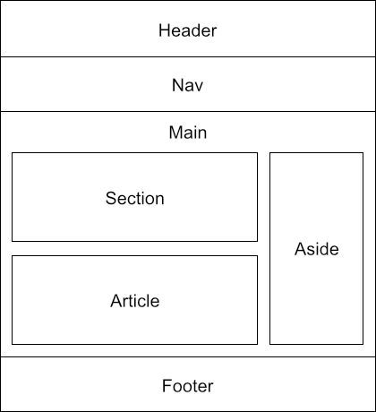

* Mac에서 코드블럭을 만들기 위해서는 ₩를 누른다 영어자판에서는 `(백쿼트)가 만들어짐
* 참고 링크 : https://yunbinni.tistory.com/63
## Html을 사용하기 위한 기본 문법 정리

### Dafault 구성

``` html
<!DOCTYPE html> <!--현재 문서는 html로 작성되었다는 의미-->
<html lang="ko">  <!--html문서로 시작하고 언어를 한국어로 설정-->
<head> <!--브라우저의 정보입력 시작-->

    <meta charset="UTF-8"> <!--meta정보를 입력-->
    <title> 타이틀을 입력해주세요 </title> <!--주소탭에 지정될 타이틀-->
    <body> <!--문서 내용입력 시작-->
        
    </body> <!--문서 내용입력 끝-->   
</head> <!--브라우저의 정보입력 끝-->
```

### 문서 구조
<figure>
    
</figure>
